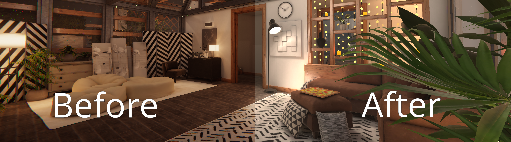
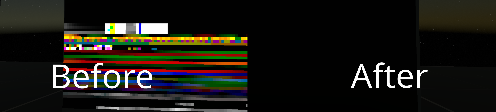

# VRC Comfort

VRChat lacks accessibility and comfort options that I can benefit from. I aim to fix this without resorting to modifying the client. Why? Because I suffer from vision sensitivity and VRChat currently does not offer any accessibility options that are stable and beneficial to my needs.

### Why is this needed?

There are too many VRChat worlds that do not offer options to disable/control Post Processing or AudioLink, Or the world added controls but they are insufficient. To some people these are minor things or can affect the "experience" of the world and therefor should not be added to the game but I disagree. Attempts to convince the developers of VRChat to add a post processing toggle have been met with pushback. The devs believe an additive solution would be better instead of overriding the world settings but I have found this does not help me.

The issue this solves is something I suffer with every day. I suffer from vision issues but not color blindness. Visual overestimation reactions similar to seizures occur but instead it triggers a fight or flight response. Reducing the difference between bright and dark & making the darkest parts light level brighter is the best solution I have found. Worlds that try to have realistic lighting increase the chance of a reaction. **This solution isn't perfect but sadly Contrast, Saturation, and Gamma sliders have not helped.** Worlds will not look 'correct' in regards to what the author intended but accessibility should **ALWAYS** take priority over the original experience. It is difficult to understand that people view the world differently and a comfortable color scheme for one person is painful for another. I have accepted that worlds may have washed out colors but in a way that is the goal of this.

#### Relevant Canny Pages

* https://feedback.vrchat.com/feature-requests/p/toggle-world-post-processing-locally
* https://feedback.vrchat.com/feature-requests/p/toggle-to-disable-bloom-and-other-post-process-effects
* https://feedback.vrchat.com/feature-requests/p/option-to-disable-postprocessing-clientside
* https://feedback.vrchat.com/feature-requests/p/disable-post-processing-stack
* https://feedback.vrchat.com/open-beta/p/1236-gamma-slider
* Might Benefit? https://feedback.vrchat.com/feature-requests/p/anti-epilepsy-option

## Included Tools

These tools are all local to you and do not affect other users.

### Post Processing Blocker

This disables post processing completely. The downside is Nameplates are also hidden.

### AudioLink Blocker

This disables most AudioLink features to reduce motion in the world. This only works for the GrabPass version of AudioLink. This also disables the Furality Luma effects. While rare, some shaders may lose depth and break.

## How to use

* Import [VRCFury](https://gitlab.com/VRCFury/VRCFury)
* Import the Unity package
* Drag prefab to the root of your avatar. Prefabs are located at `Assets/Comfort/VRCFury/`

### Also See

* [Flux Bloom Removal Shader by Rollthered](https://rollthered.booth.pm/items/3092302) | This clamps bloom wihout removing other post processing effects
* [AntiMigraine Light Limiter by Eremite](https://github.com/Erumite/Eremite_VRC/tree/master/Assets/Eremite/Shaders/AntiMigraine_Light_Limiter) | Provides multiple options to control how visuals look
* [Accessibility in VRChat Worlds](https://vrclibrary.com/wiki/books/accessibility-in-vrchat-worlds) | A general writeup of accessibility issues to consider during world development
